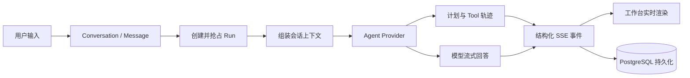
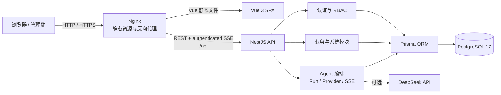

# NEBULA · Agent 工作台与全栈实验项目

> 一个用来实践 Agent 产品化、全栈开发和真实部署链路的个人项目。

[在线预览](https://shenfan1231.top) · [生产部署文档](docs/deployment/production.md) · [GitHub 仓库](https://github.com/ShenFan1231/ShenFanSoul)

NEBULA 是我持续开发和验证想法的个人全栈实验场。项目以 Agent 工作台为核心，同时包含数据看板、动态权限、NestJS API、PostgreSQL 持久化，以及从构建、迁移、健康检查到 HTTPS 发布的完整链路。

> [!IMPORTANT]
> 这不是一个开箱即用的商业系统，而是我的个人实验项目。它主要用于探索 Agent 产品设计、执行编排、全栈实现与自动化部署，功能和实现会随着我的研究持续调整。

## 前端能力

前端不只是一个管理后台模板。它最重要的作用，是把 Agent 从“输入一句话、等待一个答案”的黑盒，变成一个可以观察会话、任务、步骤、工具轨迹和流式结果的工作台。

### Agent 工作台（核心）

这个项目想展示的是：**我对 Agent 的理解已经不只停留在调用模型 API，而是能够把 Agent 拆成会话、任务、上下文、执行步骤、事件流、状态与持久化，并独立完成前后端闭环。**

| 能力维度 | 项目中的实现 |
| --- | --- |
| 会话建模 | Conversation、Message、Run、Tool Call 独立建模并关联持久化 |
| 任务编排 | 创建 Run、原子抢占任务、推进步骤、完成或失败状态收敛 |
| Provider 抽象 | 通过统一接口切换本地演示 Provider 与 DeepSeek Provider |
| 上下文管理 | 按会话加载历史消息，裁剪上下文后传递给模型 |
| 流式输出 | 解析 DeepSeek 上游数据流，再通过认证 SSE 向工作台推送增量内容 |
| 事件协议 | 统一处理 `run`、`task`、`tool`、`message` 等结构化事件 |
| 可观测执行 | 展示任务进度、当前步骤、Tool 输入输出、耗时与最终状态 |
| 稳定性处理 | 支持超时、主动取消、重复执行冲突和失败状态持久化 |
| 权限隔离 | 使用 `agent:view`、`agent:run` 权限，并按用户隔离会话与任务 |



当前 Tool 步骤重点验证的是生命周期建模、事件轨迹和前端可观测性；本地 Provider 提供可重复的演示计划，DeepSeek Provider 负责真实流式生成。Provider 接口已经为后续接入真实工具执行器留出了清晰边界。

### 其他前端能力

- **数据工作台**：核心指标、业务趋势、流量来源、区域分布与系统状态可视化
- **业务管理**：订单、项目、通知、用户、角色和系统设置等完整管理页面
- **动态权限**：登录后根据服务端返回的角色、菜单与权限生成可访问路由
- **细粒度控制**：同时支持页面、菜单和按钮级权限控制
- **管理端体验**：多标签页、KeepAlive、明暗主题、侧边栏折叠与响应式布局
- **工程化开发**：Vue 3、TypeScript、Vite、Pinia、Vue Router 与 UnoCSS
- **双数据模式**：支持内置 Mock 与真实 API，兼顾纯前端演示和全栈联调

### 核心页面

| 场景 | 能力 |
| --- | --- |
| Agent 工作台 | 会话管理、Run 状态、Tool 轨迹与流式消息 |
| 数据看板 | 指标卡片、趋势图表、动态信息、流量来源与区域分析 |
| 订单中心 | 多条件筛选、分页、详情与状态流转 |
| 项目管理 | 项目列表、创建、编辑、详情与删除 |
| 系统管理 | 账号、角色权限、菜单、设置与操作日志 |
| 交互体验 | 多标签页、页面缓存、主题切换、动效与响应式布局 |

### 演示账号

| 角色 | 账号 | 权限范围 |
| --- | --- | --- |
| 超级管理员 | `admin` | 全部页面和操作权限 |
| 管理员 | `manager` | 常用管理和业务权限 |
| 运营 | `operator` | 运营及数据查看权限 |

种子数据的默认密码为 `nebula123`。Mock 模式可使用任意不少于 6 位的密码。

## Agent 后端与服务端能力

- **Agent 执行编排**：管理会话上下文、Run 生命周期、步骤进度、事件分发与结果落库
- **Provider 可替换**：用依赖注入隔离模型实现，可在本地演示与 DeepSeek 之间切换
- **双层流式链路**：消费模型上游流，并通过认证 SSE 将结构化事件推送给前端
- **真实后端**：NestJS 模块化 API，不依赖 Mock 才能完成核心业务流程
- **身份与权限**：JWT Access Token、Refresh Token、安全 Cookie、会话管理和细粒度权限校验
- **持久化业务**：Prisma 管理 PostgreSQL 模型、迁移和种子数据
- **标准化接口**：统一参数校验、响应封装、异常处理和请求上下文
- **业务审计**：用户、角色、项目、订单、系统设置与操作日志均由服务端管理
- **可部署服务**：多阶段镜像、容器健康检查、数据库自动迁移、日志轮转与资源限制
- **生产入口**：Nginx 托管前端并反向代理 `/api`，API 与数据库不直接暴露公网
- **自动发布**：GitHub Actions 校验、构建并将通过检查的 `main` 提交部署到服务器

## 系统架构



### 生产网络拓扑

| 层级 | 组件 | 对外端口 | 职责 |
| --- | --- | --- | --- |
| 接入层 | Nginx / Web | `80`、`443` | TLS、静态资源、SPA fallback、`/api` 反向代理、SSE 长连接 |
| 应用层 | NestJS API | 不公开 | 认证授权、业务接口、Agent 任务、健康检查 |
| 数据层 | PostgreSQL | 不公开 | 业务数据、权限数据、会话、审计与 Agent 运行记录 |
| 迁移任务 | Prisma migrate | 不公开 | API 启动前执行数据库迁移，成功后退出 |
| 初始化任务 | Prisma seed | 不公开 | 通过独立 `seed` profile 按需创建演示数据 |

生产环境只需向公网开放 `22`、`80` 和 `443`。PostgreSQL 位于内部 `backend` 网络，API 同时连接 `frontend` 与 `backend` 网络；外部请求必须经过 Nginx。

## 后端能力

### 服务端分层

后端代码位于 `server/`，主要采用 `Controller → Service → Repository → Prisma` 分层：

```text
server/
├─ prisma/
│  ├─ schema.prisma          # 数据模型
│  ├─ migrations/            # 版本化数据库迁移
│  └─ seed.ts                # 演示账号与业务种子数据
└─ src/
   ├─ identity/              # 登录、会话、账号、角色与权限
   ├─ business/              # 看板、订单、项目与通知
   ├─ system/                # 系统设置与操作日志
   ├─ agent/                 # Agent 会话、Run、Provider 与 SSE
   ├─ database/              # Prisma 生命周期管理
   ├─ health/                # 服务与数据库健康检查
   ├─ common/                # Filter、Interceptor、Middleware、Decorator
   └─ config/                # 环境变量解析与启动校验
```

### API 模块

所有接口默认使用 `/api` 前缀。

| 模块 | 主要路由 | 能力 |
| --- | --- | --- |
| 健康检查 | `GET /api/health` | API 与数据库存活状态 |
| Agent | `/api/agent/*` | 会话、任务运行、状态查询与认证 SSE 事件流 |
| 身份认证 | `/api/auth/*` | 登录、刷新令牌、用户信息、动态菜单、退出登录 |
| 账号与权限 | `/api/system/accounts`、`/api/system/roles` | 账号管理、角色、权限、菜单和访问范围 |
| 数据看板 | `/api/dashboard/*` | 指标总览、趋势、动态、系统状态、来源与区域数据 |
| 订单 | `/api/orders/*` | 查询、详情、创建和状态流转 |
| 项目 | `/api/projects/*` | 分页查询、详情、新建、更新与删除 |
| 通知 | `/api/notifications/*` | 通知列表与批量已读 |
| 系统配置 | `/api/system/settings` | 配置读取与更新 |
| 操作日志 | `/api/system/operation-logs` | 管理操作审计与分页查询 |

### 安全与接口约束

- 全局 DTO 校验启用 `transform`、白名单和未知字段拒绝
- JWT Guard 默认保护业务接口，公开接口通过显式装饰器声明
- 权限 Guard 根据服务端权限标识进行访问控制
- Refresh Token 支持 HttpOnly Cookie，并可按环境启用 `Secure` 与 `SameSite`
- 生产环境强制校验数据库连接、JWT 密钥和 Agent Provider 配置
- Nginx 为 SSE 关闭代理缓冲，并将读写超时扩展到 180 秒
- API、Web 与 PostgreSQL 均配置容器健康检查
- 容器日志使用大小与文件数限制，避免单机日志无限增长

### 数据模型

Prisma Schema 覆盖以下核心领域：

- Agent Conversation、Message、Run 与 Tool Call
- 用户、角色、权限、菜单及其关联关系
- Refresh Session 与登录会话
- 订单、项目、看板指标、流量来源与区域数据
- 系统设置、通知、通知已读状态与操作日志

数据库变更通过 `server/prisma/migrations/` 纳入版本控制；生产启动时由一次性 `migrate` 服务先执行 `prisma migrate deploy`，迁移成功后 API 才会启动。

## 本地运行完整后端

### 环境要求

- Node.js 22+
- pnpm 10
- Docker Desktop 或 Docker Engine + Compose

### 1. 安装依赖

```bash
pnpm install
```

### 2. 准备服务端环境变量

```bash
cp server/.env.example server/.env.local
```

Windows PowerShell：

```powershell
Copy-Item server/.env.example server/.env.local
```

默认配置连接本机 `5432` 端口。请确保 `JWT_SECRET` 不少于 32 个字符。

### 3. 启动 PostgreSQL 并初始化数据

```bash
docker compose -f compose.dev.yaml up -d postgres
pnpm db:migrate
pnpm db:seed
```

### 4. 启动 API 与前端

分别在两个终端运行：

```bash
pnpm dev:api
```

```bash
pnpm dev:web
```

| 服务 | 地址 |
| --- | --- |
| Web | <http://localhost:5273> |
| API | <http://localhost:8080/api> |
| 健康检查 | <http://localhost:8080/api/health> |
| PostgreSQL | `localhost:5432` |

也可以让 Docker 同时运行 API 与 PostgreSQL：

```bash
docker compose -f compose.dev.yaml up -d --build
pnpm dev:web
```

首次使用空数据库时，仍需先执行迁移和种子数据初始化。

## 生产部署

项目面向单台 Ubuntu 主机提供可复现部署，核心文件如下：

| 文件 | 作用 |
| --- | --- |
| `compose.prod.yaml` | PostgreSQL、迁移任务、API、Web、Seed 与 Certbot 编排 |
| `compose.https.yaml` | 为 Web 追加 `443`、证书卷和 HTTPS Nginx 配置 |
| `server/Dockerfile` | API、迁移工具的多阶段构建 |
| `deploy/web.Dockerfile` | 构建 Vue 并生成 Nginx Web 镜像 |
| `deploy/nginx*.conf` | HTTP/HTTPS、API 代理、SSE、缓存与安全响应头 |
| `deploy/bootstrap-ubuntu.sh` | 安装 Docker、配置 UFW、Swap 与开机启动 |
| `deploy/deploy-production.sh` | 按 Git SHA 构建、迁移、发布并执行健康检查 |

### 本地验证生产编排

```bash
cp .env.production.example .env.production.local
```

替换模板中的密码、JWT 密钥、公开域名和 Agent 配置后启动：

```bash
docker compose \
  --env-file .env.production.local \
  -f compose.prod.yaml \
  up -d --build
```

按需初始化演示数据：

```bash
docker compose \
  --env-file .env.production.local \
  -f compose.prod.yaml \
  --profile seed run --rm seed
```

验证 Web 与 API：

```bash
docker compose --env-file .env.production.local -f compose.prod.yaml ps
curl --fail http://127.0.0.1/healthz
curl --fail http://127.0.0.1/api/health
```

### HTTPS

项目使用 Certbot + Let's Encrypt，通过 `compose.https.yaml` 挂载证书并切换 Nginx 配置。启用后：

- HTTP 自动跳转 HTTPS
- Refresh Cookie 切换为 `Secure`
- HSTS 与 TLS 1.2/1.3 生效
- SSE 仍保持关闭缓冲
- systemd timer 每日定时检查证书续期

域名解析、首次签发与续期安装步骤见 [生产部署文档](docs/deployment/production.md#https-transition)。

### CI/CD

`.github/workflows/deploy.yml` 提供完整流水线：

1. 安装锁定依赖并校验 Prisma Schema
2. 校验 Shell 脚本与 HTTP/HTTPS Compose 配置
3. 构建 Vue 前端与 NestJS API
4. 仅在 `main` 分支检查通过后同步代码到 `/opt/nebula-admin`
5. 使用完整 Git Commit SHA 标记镜像版本
6. 自动执行迁移、更新容器并检查 Web/API HTTPS 健康状态
7. 健康检查通过后记录当前生产版本

Pull Request 只运行校验与构建，不会接触生产 SSH 密钥或连接服务器。数据库密码、JWT 密钥、DeepSeek Key、数据卷与 TLS 证书均保留在服务器。

## 关键环境变量

### 服务端与生产环境

| 变量 | 说明 |
| --- | --- |
| `DATABASE_URL` | Prisma 使用的 PostgreSQL 连接串 |
| `JWT_SECRET` | JWT 签名密钥，至少 32 个字符，生产环境必须替换 |
| `JWT_ACCESS_TTL_SECONDS` | Access Token 有效期 |
| `JWT_REFRESH_TTL_SECONDS` | Refresh Token 有效期 |
| `COOKIE_SECURE` | HTTPS 环境应设为 `true` |
| `COOKIE_SAME_SITE` | Cookie 跨站策略：`lax`、`strict` 或 `none` |
| `CORS_ORIGINS` / `PUBLIC_ORIGIN` | 开发允许来源 / 生产公开来源 |
| `AGENT_PROVIDER` | `local` 或 `deepseek` |
| `DEEPSEEK_API_KEY` | 使用 DeepSeek Provider 时必填 |
| `DEEPSEEK_BASE_URL` | DeepSeek API 地址 |
| `DEEPSEEK_MODEL` | Agent 使用的模型 |
| `APP_VERSION` | 生产镜像版本，自动部署时使用完整 Git SHA |

完整模板见 [`.env.example`](.env.example)、[`server/.env.example`](server/.env.example) 与 [`.env.production.example`](.env.production.example)。

### 前端

| 变量 | 默认值 | 说明 |
| --- | --- | --- |
| `VITE_APP_TITLE` | `NEBULA Console` | 应用标题 |
| `VITE_APP_BASE` | `/` | 部署基础路径 |
| `VITE_API_BASE_URL` | `/api` | API 基础路径 |
| `VITE_REQUEST_TIMEOUT` | `15000` | 请求超时，单位毫秒 |
| `VITE_USE_MOCK` | `1` | `1` 使用 Mock，`0` 接入真实 API |
| `VITE_PROXY_TARGET` | `http://127.0.0.1:8080` | 本地开发代理目标 |

生产 Web 镜像固定使用同源 `/api` 并关闭 Mock。

## 技术栈

| 领域 | 技术 |
| --- | --- |
| 前端 | Vue 3、Vite、Pinia、Vue Router、UnoCSS |
| 可视化与动效 | ECharts、GSAP |
| Agent 工程 | Provider 抽象、Run 编排、SSE、流式响应、Tool 轨迹 |
| 服务端 | NestJS 11、TypeScript、REST、SSE |
| 数据层 | PostgreSQL 17、Prisma 6 |
| 认证授权 | Passport JWT、Access/Refresh Token、RBAC |
| 部署 | Docker Compose、Nginx、Certbot、Let's Encrypt |
| CI/CD | GitHub Actions、SSH、rsync |
| 包管理 | pnpm workspace |

## 项目结构

```text
.
├─ src/                     # Vue 3 管理端
├─ public/                  # 静态资源
├─ server/                  # NestJS API、Prisma、迁移与种子数据
├─ deploy/                  # 镜像、Nginx 与服务器部署脚本
├─ docs/
│  ├─ architecture/        # 分阶段后端架构说明
│  └─ deployment/          # 生产部署手册
├─ .github/workflows/       # CI/CD
├─ compose.dev.yaml         # 开发环境 API + PostgreSQL
├─ compose.prod.yaml        # 生产环境完整编排
├─ compose.https.yaml       # HTTPS Compose override
├─ package.json             # 根工作区命令
└─ pnpm-workspace.yaml      # Web + API workspace
```

## 常用命令

| 命令 | 作用 |
| --- | --- |
| `pnpm dev:web` | 启动 Vue 开发服务器 |
| `pnpm dev:api` | 启动 NestJS watch 模式 |
| `pnpm build` | 构建前端与 API |
| `pnpm build:web` | 仅构建前端 |
| `pnpm build:api` | 仅构建 API |
| `pnpm db:validate` | 校验 Prisma Schema |
| `pnpm db:migrate` | 创建并应用开发迁移 |
| `pnpm db:seed` | 写入演示账号与业务数据 |
